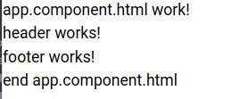
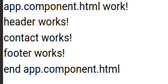
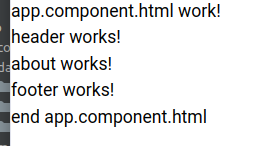
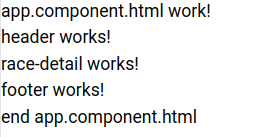
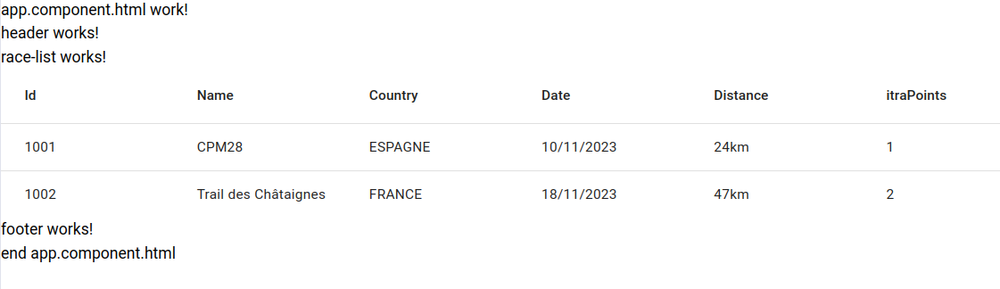

[](https://linuxmint.com/)


# TrailerplanRaceNg

This project is a simple project including multiple modules and can be build in a docker images. It was generated with [Angular CLI](https://github.com/angular/angular-cli) version 16.2.10.

## Development server

Run the server mocks in order to give the races list.
```shell
user@host:trailerplan-race-ng(main)$ json-server --  ./src/app/data/mocks/api.mocks.race-list.json
  \{^_^}/ hi!

  Loading ./src/app/data/mocks/api.mocks.race-list.json
  Done

  Resources
  http://localhost:3000/race-list

  Home
  http://localhost:3000

  Type s + enter at any time to create a snapshot of the database
GET /race-list 200 6.745 ms - -
```

In an another console in order to check the server mocks :
```shell
user@host:trailerplan-race-ng(main)$ curl http://localhost:3000/race-list
[
  {
    "id": 1001,
    "name": "CPM28",
    "country": "Espagne",
    "city": "Le village de San Nicolas",
    "zipCode": "34349",
    "itraPoints": 1,
    "mountainLevel": 5,
    "finisherLevel": 340,
    "championship": "Ligue nationale",
    "date": "2023/11/10",
    "startHour": "09:00:00",
    "distance": "24km",
    "positiveElevation": 1110,
    "negativeElevation": 1110,
    "timeLimit": "04:30:00",
    "nbOfRefuelingStation": 3,
    "nbOfTrailer": 150,
    "description": "Carrera Media (CMP28) fait environ 24 km avec 1 185 mètres de dénivelé positif. Le départ est au même endroit que les autres courses, depuis le centre-ville, devant l'église, à La Alameda (Plaza Vieja). Prendre la même direction que les autres courses jusqu'au chemin qui monte au Viso en passant par la Cueva del Mediodía, en passant par Blanquizal, les maisons de Los Peñones, Las Casillas de El Cortijo de Inagua pour monter au Viso et descendre le chemin jusqu'à la Degollada de Tasarte par l'Andén Ancho et descendre au Barrio del Hoyo par La Vistilla et revenir par le Canal del Parralillo depuis El Hoyo jusqu'au Mirador de La Sabinilla en passant par La Era del Cabuco, sentier régional de La Aldea-Mogán jusqu'à le Barrio del Pinillo et retour au point de départ.\n\nLa Carrera Media (CMP28) mesure environ 24 km de long avec 1 185 mètres de dénivelé positif. Elle part du même endroit que les autres racines, de la vieille ville, devant l'église, à La Alameda (Plaza Vieja). Prendre la même direction que les autres courses jusqu'au chemin qui monte à El Viso par la Cueva del Mediodía, en passant par Blanquizal, les maisons de Los Peñones, Las Casillas de El Cortijo de Inagua pour monter à El Viso et descendre le chemin vers Degollada de Tasarte par l'Andén Ancho et descendre au Barrio del Hoyo par La Vistilla et revenir par le Canal del Parralillo depuis El Hoyo jusqu'au Mirador de La Sabinilla en descendant par La Era del Cab uco, régional de La Aldea-Mogán chemin jusqu'au Barrio del Pinillo et retour au point de départ."
  },
  {
    "id": 1002,
    "name": "Trail des Châtaignes",
    "country": "France",
    "city": "Cormeilles-en-Parisis",
    "zipCode": "95240",
    "itraPoints": 2,
    "mountainLevel": 3,
    "finisherLevel": 410,
    "championship": "Ligue nationale",
    "date": "2023/11/18",
    "startHour": "07:00:00",
    "distance": "47km",
    "positiveElevation": 1440,
    "negativeElevation": 1440,
    "timeLimit": "08:00:00",
    "nbOfRefuelingStation": 3,
    "nbOfTrailer": 500,
    "description": "Le gros morceaux du TDC, elle est de retour en 2023. Comme toute bonne course du TDC qui se respecte, vous partirez du Fort pour un premier tour dans les douves. En sortie de celui ci, direction une prairie pour faire le tour du Fort et ressortir sur la Route Stratégique afin de rejoindre le cœur des Buttes sur quelques kilomètres qui vous feront basculer vers les marches du Parc Schlumberger. En sortie du Parc, vous découvrirez un nouveau tronçon avant de recouper la route stratégique et redescendre vers le 1er ravito de la journée. Prenez des forces avant de rejoindre la zone de la carrière. Certes, les descentes sont longues mais les montées le sont tout autant. Rendez vous au kilomètre 24 pour un nouveau ravitaillement avant de vous diriger vers les Buttes de Sannois pour un peu de tourisme en sous-bois et regarder les moulins. Place ensuite aux historiques marches de la Buttes des Châtaigniers (que de souvenirs de cette première édition). Il va falloir penser à revenir après cette séquence émotion, en passant essentiellement en sous bois jusqu'à votre dernier ravito en course (kilomètre 38). Vous reconnaissez le chemin, c'est normal. Comptez à nouveau les marches :-) Direction le fort avec vos frontales allumées pour 3 kilomètres au cœur de celui ci. Aller, c'est terminé."
  }
```

In this window the application can be start with :
```shell
user@host:trailerplan-race-ng(main)$ ng serve
```

And then navigate to the modules in the application :

The home page in http://localhost:4200 :


The page contact http://localhost:4200/contact :


The page about http://localhost:4200/about :


The page race-detail http://localhost:4200/race-detail :


The page race-list http://localhost:4200/race-list :


In this last module it requests the mocks server in the 3000 port, and it shows the race list for few attributes. It uses the pipes in
order to make a uppercase for the country and apply a display change for the date it applies the shortDate format.
